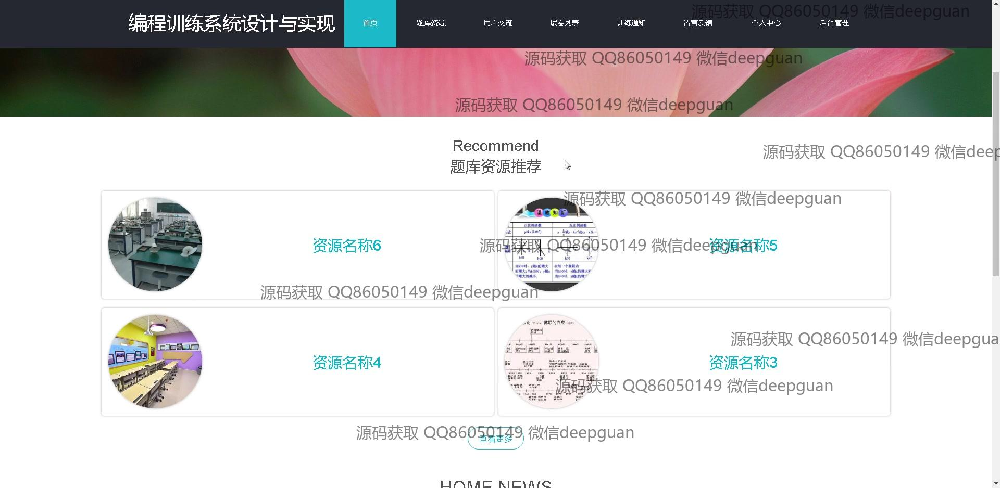

<h1 align="center">编程训练系统设计与实现</h1>

## 简介
编程训练系统：角色分为管理员、用户；功能包括用户管理、题库管理、试卷管理、资源上传、交流与反馈、密码和信息修改，支持丰富的交互和学习体验。    --计算机毕业设计源码；毕设源码；java毕业设计源码

## 联系方式

<h3 align="center">获取完整代码与数据库文件 + 微信：deepguan QQ: 86050149 QQ群: 783742310</h3>

<h3 align="center">可帮忙远程部署 包运行成功！提供远程部署、修改代码、设计文档指导、代码讲解等服务！</h3>

## 功能介绍（完整见运行截图）
管理员：管理系统功能包括用户注册、登录和退出，以及访问首页、个人中心、用户交流、题库资源管理和考试管理等模块。管理员可以进行试题和试卷的管理与设置，资源的上传和编辑，密码的重置以及用户反馈的查看和处理。系统提供导航栏功能切换、用户交流和反馈的处理功能，支持用户信息与系统状态管理。

用户：用户能够注册、登录和退出系统，并访问主页、个人中心、题库资源、试卷列表、用户交流、留言反馈和个人管理等模块。用户可以修改个人信息、上传资源、参与题库练习和考试，并通过评论与其他用户交流。系统设计支持用户进行留言反馈，浏览推荐的学习资源，并查看个人成绩记录。

## 运行截图

本代码来源于网络,仅供学习参考使用!

